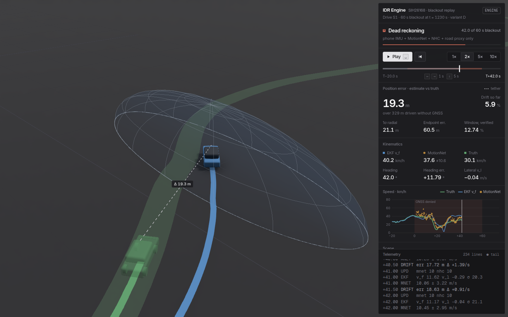
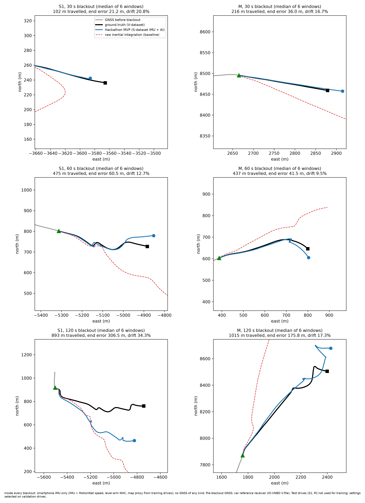

# SIH26168: Intelligent Dead Reckoning MVP

This MVP keeps estimating a car's position through a GNSS blackout. It uses only a smartphone IMU, learned motion, vehicle physics and road geometry.
It is built on the [IO-VNBD](https://github.com/onyekpeu/IO-VNBD) dataset and follows
the *Model Build Playbook*: three core features, strict no-leakage rules, and an honest ablation.

```
IO-VNBD replay / Android / external IMU  ──►  SensorSample stream
   1. Preprocess + align     level, phone→vehicle rotation, bias, clip, causal low-pass
   2. MotionNet + 2-D EKF     GRU speed + uncertainty → pseudo-measurement; GNSS only when healthy
   3. NHC + map constraint    soft "no sideways sliding" + road matching (switchable)
                         ──►  position, speed, heading, mode (GNSS+INS / DEAD RECKONING)
```

## 3D web dashboard (`web/`)

A Python-backed dead-reckoning engine that keeps estimating a car's position through a GNSS blackout
using only a smartphone IMU. The web front-end replays a blackout in 3D: the true path against the
engine's estimate, its GNSS/dead-reckoning mode, speed and accumulated drift.



```bash
python scripts/export_web_data.py     # real engine replays -> web/public/data (needs the dataset + torch)
cd web && npm install && npm run dev  # http://localhost:5173
npm run build                         # type-check + production build in web/dist
```

**Hosted on GitHub Pages:** https://yadavallisaketh-gif.github.io/syedvers/.
`.github/workflows/deploy-pages.yml` publishes it on every push to `main` that touches `web/`. It
also runs the build as a check on pull requests. One-time setup: **Settings → Pages → Build and
deployment → Source: GitHub Actions**.

- **Real engine output.** `scripts/export_web_data.py` runs `src/ui/sim.replay_window` (the same path as the
  Streamlit app, variant D, `sih_mvp` profile) on all 12 held-out 60 s windows. It writes every 10 Hz sample from
  20 s before GNSS loss to 15 s after it returns, plus every EKF measurement update. The export **fails**
  if a replay's drift differs from `results/sih/eval_windows_sih_mvp_anomaly.csv`. It does not differ: all 12 match
  (60 s median 9.91%). `--summary-only` writes only the verified results, without the dataset.
  Without an export the app runs on a labelled `SYNTHETIC` placeholder.
- **Scene** (React Three Fiber, 1 unit = 1 m):
  - matte PBR (`meshStandardMaterial`, roughness >= 0.7, metalness 0.1);
  - a soft key light whose shadow follows the car, a procedural studio environment (no HDRI download),
    and N8AO ambient occlusion.
  - Layers: the estimated car and a translucent ground-truth ghost; the ribbons of both tracks; a dashed
    **drift tether** between the cars, labelled with the live error; and the EKF's **1σ uncertainty volume**.
    The volume's footprint is the real covariance ellipse (from `p_xx`, `p_yy`, `p_xy`). Its dome height is
    for display only.
- **Panel**: mode indicator, transport, live error / drift readout, kinematics, speed trace (hover, click to seek),
  scene layers, window picker with verified results. A **raw telemetry console** streams EKF state, MotionNet
  output, drift, per-second measurement-update counts, χ² rejections and mode events.
- **Keys**: `Space` play/pause · `←/→` scrub 1 s (`Shift` 5 s) · `1` `2` `3` chase / orbit / top-down.
  Deep links: `?replay=S1_1230&t=42&cam=plan`.
- **Checks**: `npm run screenshot` (with `npx vite preview` running) captures desktop and mobile screenshots
  and fails if the page logs an error or requests anything outside its own origin (fonts are bundled).

## Results: Hackathon MVP (passenger car)

**60 s GNSS blackout: 9.9% median drift** on held-out test drives. See it replayed live with
`streamlit run src/ui/app.py` (section below).

`configs/sih_mvp.yaml` is the current pipeline (lever-arm NHC with turn gating, MotionNet at 10 Hz,
map proxy). Pre-blackout GNSS comes from the car's reference receiver. The IO-VNBD phone GPS lags the
IMU by seconds, and latency compensation is deferred to the real-world phase. **Inside every blackout
no GNSS of any kind is used.**

Held-out test drives S1 (unseen drive of a training driver) and M (a driver not in training), 36 blackouts,
full system D: MotionNet + EKF + lever-arm NHC + road proxy (median drift % of distance travelled):

| Blackout | 30 s | 60 s | 120 s |
|---|---|---|---|
| Mean distance travelled | 251 m | 470 m | 957 m |
| Hackathon MVP | 17.0% | **9.9% (< 10%)** | 21.3% |
| Raw inertial integration (baseline) | 80.3% | 107.4% | 171.4% |

Submission figures (300 dpi), in `results/sih/`:
- `sih_overview_S1_sih_mvp.png`, `sih_overview_M_sih_mvp.png`: the full ground-truth track
  (V-dataset) with every 60 s blackout, ground truth vs MVP estimate, labelled with drift per blackout.
- `sih_panels_sih_mvp.png`: for each drive and blackout length, the **median-drift** window (not the
  best one), comparing ground truth, the MVP and raw inertial integration.



The full technical report on scope, architecture and limitations is in
[`docs/DETAILED_MVP_REPORT.md`](docs/DETAILED_MVP_REPORT.md).

Reproduce the numbers and figures:

```bash
python -m src.evaluate --config configs/sih_mvp.yaml --tag sih_mvp --sih-plots
```

Read these numbers honestly:
- **Only 60 s passes.** The 60 s median is 9.9% over 12 windows; 30 s and 120 s do not meet < 10%.
- **These drives were seen during development.** The test drives were evaluated repeatedly while the
  pipeline was built. Settings were chosen on validation drives, but an older configuration
  (`pre-Step-1` in `archive_experiments/ablation.py`) scores 10.9 / 7.8 / 11.6% on the same windows. It was
  worse on validation (23 / 25 / 21%) and relies on a fixed levelling, so it was not kept.
- **Accelerometer-free speed was tried and rejected.** MotionNet-only speed during blackouts
  (`filter.dr_accel_mode: decouple`) was worse on validation (25 / 19 / 20% vs 18 / 19 / 14%) and on
  test (60 s: 12.8%), so the MVP keeps the accelerometer.
- **Phone GPS is much worse.** With the phone's own GPS before the blackout, the same pipeline gives
  about 34 / 21 / 50%.

### Anomaly & misalignment detector (`src/anomaly_detector.py`)

A causal, IMU-only watchdog runs ahead of preprocessing in every variant except raw INS (A).
Thresholds are in `configs/base.yaml: anomaly` and come from the training drives.
- **Shock (pothole / speed bump).** |a_z − rolling 1 s mean| > 5 m/s² (training p99.95). For the next
  1 s the accelerometer process noise on v_f and v_l is multiplied by 100, so MotionNet, NHC and
  the filter's momentum carry the speed through the jolt.
- **Mount slip.** A gyro burst (‖ω − rolling mean‖ > 1 rad/s) opens a candidate. It is confirmed only if
  the mean specific force over the next 1 s has rotated by more than 3° relative to the second before.
  Bumps and sharp turns also make gyro bursts, and this check filters them out. On a confirmed slip, the
  gravity estimate of the dynamic attitude filter is rotated by the measured rotation (instant
  re-levelling) and the mount-dependent lateral bias `b_l` is reopened. An unconfirmed burst is
  counted as a *transient* and handled like a shock.
- `python -m src.evaluate` prints a per-drive summary of what was caught and how much of it fell inside
  blackouts. Each window row in the CSV also records `anom_shock`, `anom_transient` and `anom_slip`.
- Thresholds come from 16.7 h of training driving. Ungated 1 s gravity estimates wander by > 17° 1% of
  the time on normal roads. A first version that confirmed slips at 3° over such windows fired about
  500 times per hour, and its re-levels raised the 60 s test median to 11.4%. It was replaced.
- Held-out test drives S1 + M (143 km): 22 shocks and 1 transient were caught and suppressed, and no
  mount slip was confirmed. None of them fell inside a blackout window, so the benchmark is unchanged
  (60 s median 9.91% vs 9.90% without the detector; the 0.004-point difference comes from pre-blackout
  Q inflation). The detector is a robustness guard; it does not improve the headline number.

## Passenger Car MVP dashboard and mobile model

```bash
pip install -r requirements.txt
streamlit run src/ui/app.py            # interactive replay of a 60 s blackout on test drive S1 or M
python scripts/export_onnx.py          # -> results/models/motionnet_mobile.onnx (+ .json sidecar)
```

- **Dashboard.** `src/ui/app.py` animates ground truth (green) against the IDR estimate (blue) for any of
  the 12 held-out 60 s blackouts, with a live GNSS state indicator and speeds for EKF v_f, MotionNet and truth.
  - Each replay runs the real engine through `src/ui/sim.py`, which reproduces `src.evaluate` window for
    window (variant D, `sih_mvp` profile, passenger-car lever arm r_x = 1.8 m locked).
  - The default window per drive is its median-drift window, not the best one.
  - The street-map view needs internet for OpenStreetMap tiles; the default local-metres view works offline.
- **Mobile model.** `motionnet_mobile.onnx` (74 KB, opset 17) has a fixed input of `(1, 50, 5)`: 5 s of
  10 Hz features. Feature normalisation and the validation-calibrated σ scale are baked into the graph.
  - Outputs: `speed` and `sigma` (m/s).
  - The export script checks ONNX Runtime against PyTorch; the maximum difference is 4e-6 m/s.

### How the numbers were produced

1. **Train.** MotionNet was trained on 30 drives. The window length (5 s vs 10 s) was chosen on the 3 validation drives.
2. **Choose.** Every pipeline change (Steps 1-3, the MVP profile, the anomaly detector) was compared on the
   validation drives, and kept only if it helped there. The full ablation history, including the failed attempts, is in
   [`archive_experiments/`](archive_experiments/README.md).
3. **Test.** The held-out test drives S1 and M are reported with the chosen settings.
4. **Transparency note.** Development runs on the test drives exposed two *robustness bugs*: a divergence while circling a roundabout, and a wrong turn at junctions. Their fixes are generic and unit-tested, and they are listed in the change log below.

### Known limitations (honest list)

- **Not yet at "a few percent" drift.** Median drift is 17 / 9.9 / 21% at 30 / 60 / 120 s; only 60 s meets < 10%. The remaining error is mostly heading drift from the phone gyro and speed that 10 Hz phone data only weakly reveals. MotionNet under-predicts at motorway speeds (see `motionnet_gru_test_speed.png`).
- **Map constraint uses a proxy, not OSM.** OSM was unreachable from the build machine, so the map is road geometry from the *training* drives' tracks. It can only help where a test route overlaps a training route. With a real OSM extract, pass `--set map.osm_path=...`.
- **Test set is small.** It has two drives and two drivers (A, B), all in the Coventry area, from one IO-VNBD phone family. Driver E's phone (noisier gyro) is only in training and validation, where median drift is around 20%.
- **GNSS before the blackout comes from the car's reference receiver**, time-aligned to the phone. The phone's own GPS lags by seconds in IO-VNBD. `--set data.gnss_source=phone` is supported, but that mode is not what the table reports.
- **Phone remount mid-drive is only partly handled.** The anomaly detector re-levels after a confirmed mount slip,
  but no slip was confirmed on the real test drives; the phone→vehicle yaw is still fitted once, from pre-blackout data.
- **Label quality.** Labels exist only where the dataset's clock could be re-synchronised. Driver D (Y1) is excluded completely.

## Development history

The pipeline went through a pre-Step-1 baseline, Steps 1-3, the MVP profile and two anomaly detectors. Several
attempts failed: 1 Hz MotionNet, the MotionNet bias state, accelerometer decoupling, and the first anomaly detector.
[`archive_experiments/README.md`](archive_experiments/README.md) has the timeline with validation and test numbers,
the ablation tables, and the former headline results of the pre-Step-1 pipeline.

## Quick start

```bash
pip install -r requirements.txt
python -m src.download_data                  # ALL 72 drives, ~430 MB, checksum-verified (the map needs the training drives)
python -m pytest -q                          # 73 unit tests, no dataset needed
python -m src.evaluate --config configs/sih_mvp.yaml --tag sih_mvp --plots 0   # benchmark: 60 s median drift 9.91%
streamlit run src/ui/app.py                  # replay dashboard
python scripts/export_web_data.py            # data for the 3D dashboard (web/)
cd web && npm install && npm run dev         # 3D dashboard at http://localhost:5173
```

Optional:

```bash
python -m src.audit leakage --config configs/sih_mvp.yaml   # pass/fail leakage checklist (10 checks)
python -m src.audit schema --drive S1        # column roles, units, timing and sync report
python -m src.demo_replay --drive S1 --t-start 2580 --duration 60 --speed 10   # terminal demo
python -m src.demo_replay --synthetic-200hz  # same engine, external 200 Hz IMU
python -m archive_experiments.tune           # validation-only tuning sweep (historical)
python -m src.train_motion                   # retrain MotionNet - OVERWRITES results/models/motionnet.pt
```

The trained MVP model is checked in at `results/models/motionnet.pt` (the config's `model.path`), so the
dashboard and evaluation run without training. It was trained on the Step 1 features: validation RMSE 5.65 m/s,
test RMSE 3.04 m/s. Retraining is seeded and reproduced it exactly on a 4-core CPU; other hardware or library
versions may give a slightly different model, so the benchmark should be checked with the committed one.
Any config value can be overridden, for example `--set map.enabled=false` or `--set evaluate.durations_s=[30,60]`.

## What the dataset audit found (and why it matters)

The playbook says "always inspect the actual column schema before coding assumptions". Doing that
changed the design:

| Finding | Evidence | What the pipeline does |
|---|---|---|
| The "synchronised" phone and vehicle files are **not time-aligned**. Row pairing is off by up to ~9 s and breaks after recording gaps. | The phone's vertical gyro correlates 0.93–1.0 with the car's yaw-rate sensor only after a shift. | `data_io.synchronise` estimates the clock offset per 10-min segment. Labels exist only where correlation ≥ 0.5 (or where the segment sits between agreeing segments). This affects label alignment only. |
| **Accelerometer X/Y are Earth-referenced**, rotated by the phone's own azimuth. The `GRAVITY` columns are constant (0, 0, 9.8066). | Rotating X/Y back by `ORIENTATION (Yaw)` gives a stable phone→vehicle angle (fit 0.8–0.9). Without it the angle wanders by ±60°. | `data_io` de-rotates with the phone's own azimuth, which is computed on the phone with no GNSS. The rest of the pipeline sees a body-frame accelerometer, as a live Android stream would provide. |
| The gyro column named **"Pitch" is the vertical-axis rate**. | 0.93–1.0 correlation with the vehicle yaw rate. The two horizontal axes cannot be told apart. | `configs/base.yaml: data.gyro_columns`. MotionNet uses only the rotation-invariant horizontal gyro magnitude. |
| Phone "GPS SPEED (Kmh)" is actually **m/s**. | Its median ratio to the car's speed in m/s is 0.99. | Handled in the optional `gnss_source: phone` mode. |
| Drive **Y1** (driver D) cannot be aligned. **Driver E's phone gyro is ~3× noisier**. | Sync correlation < 0.3 everywhere for Y1; gyro std 0.3 vs 0.1 rad/s. | Y1 is excluded. Driver E drives are kept for training speed diversity. |

Run `python -m src.audit schema --drive <id>` to reproduce every row of this table for any drive.

## Data rules and how they are enforced

| Rule (playbook §3) | Enforcement |
|---|---|
| No GNSS, wheel speed, CAN or OBD during a blackout | `blackout.apply_blackout` splits a segment into an `EstimatorInput`, which **refuses** any `ref_*` column and any unmasked GNSS inside the window, and a `HiddenTruth`. `EKF2D.update_gnss_*` raises if called while GNSS is disabled. Evaluation asserts **zero** GNSS updates inside every blackout. |
| Split by drive, not row | `configs/base.yaml: split` (30 train / 3 val / 2 test drives). `dataset.check_split` rejects overlap. Windows are cut after the split and never cross a session or unlabelled gap. |
| Normalisation from training only | `train_motion.py` fits mean/std on training windows. Provenance is stored in the checkpoint and checked by `audit leakage`. |
| Reference channels only as labels | MotionNet target = reference speed at the **last** sample of the window. `assert_allowed_features` rejects anything named gnss/gps/ref/lat/lon/wheel/speed. |
| NN predicts motion, not coordinates | MotionNet outputs forward speed plus log-variance. |
| Map matching separate and switchable | `map.enabled`. Every result reports **C+NHC (no map)** next to **D (with map)**. |
| Report failure honestly | Windows are chosen deterministically and evenly across each drive. None are dropped. Per-window CSVs are in `results/sih/` (MVP) and `archive_experiments/results/`. |
| Sensor-agnostic core | `sensors.SensorSource`. The same `NavigationEngine` runs IO-VNBD replay at 10 Hz and a synthetic IMU at 200 Hz (`tests/test_navigation.py`, `--synthetic-200hz`). |

## The three core features

**1. Preprocessing and alignment** (`src/preprocess.py`)
- Level the phone using stationary samples, or straight-driving samples when the car never stops. A circling car otherwise looks like a tilted phone.
- Estimate the phone→vehicle yaw by solving a 2-D Wahba problem against GNSS-derived `[dv/dt, v·ω]`. The centripetal term makes this robust to road grade.
- Subtract stationary gyro and accelerometer bias, clip spikes, then apply a **causal** 2nd-order Butterworth filter. There is no look-ahead, so it is valid live.
- The same code runs block-wise for training and sample-by-sample in the engine. A test checks the two are identical.
- In evaluation, alignment uses **only pre-blackout data**.

**2a. MotionNet** (`src/models/motion_net.py`, `src/train_motion.py`)
- Small GRU: 5 vehicle-frame features (a_f, a_l, a_u, ω_up, |ω_h|) over a window of 10 Hz samples → speed plus log-variance.
- Training is Huber, then Gaussian NLL. The predicted σ is recalibrated on validation drives.
- `--compare` trains a causal TCN with the same split.

**2b. 2-D EKF** (`src/fusion/ekf2d.py`)
- State `[x, y, v_f, v_l, yaw, b_a, b_g]`: the playbook state plus an explicit lateral velocity, so NHC is a real measurement.
- GNSS position, speed and course updates are applied only while healthy, with χ² gating and recovery when a channel keeps being rejected.
- Reacquisition inflates R for a few seconds. The **displayed** position eases onto the fix instead of teleporting (`disp_x`, `disp_y`).
- During dead reckoning, the MotionNet speed is a pseudo-measurement with its predicted σ. IMU biases are frozen as "consider" states, because pseudo-measurements cannot observe them.

**3. Constraints** (`src/constraints/`)
- **NHC**: a soft `v_l = 0` constraint (σ configurable: car 0.15, motorcycle ~1.0 m/s). It may only change velocity. Letting it rotate the heading turns a lateral-accel error into a phantom turn (see `tests/test_navigation.py`).
- **Map matching**: candidates lie within a radius of the *estimated* position and are scored by perpendicular distance, heading and continuity. Junctions where two differently-oriented roads score alike are **skipped**, not guessed. A matched road gives a soft across-road position and heading update, never a hard snap.
- **Map source**: loaders accept OSM Overpass JSON, OSM XML or GeoJSON (`python -m src.constraints.fetch_osm`). The environment that produced these results could not reach any OSM server, so the reported map results use a **road-geometry proxy built from the reference tracks of the *training* drives**. The test drives are never used. With an OSM file, pass `--set map.osm_path=...`.

## Project structure

```
configs/base.yaml            every tunable: paths, split, preprocessing, model, filter noise, map, evaluation
configs/iovnbd_manifest.csv  72 synchronised drives with LFS SHA-256 (download + integrity)
src/download_data.py         IO-VNBD fetcher (no git-lfs needed)
src/data_io.py               loader, schema mapping, clock sync, ENU conversion, audit checks
src/sensors.py               SensorSample / SensorSource (CSV replay, synthetic 200 Hz)
src/preprocess.py            Feature 1
src/anomaly_detector.py      pothole-shock / mount-slip watchdog (Q inflation, re-levelling)
src/blackout.py              GNSS mask generator, EstimatorInput / HiddenTruth
src/models/motion_net.py     Feature 2a (GRU / TCN + wrapper with input guards)
src/fusion/ekf2d.py          Feature 2b
src/constraints/nhc.py       Feature 3 (NHC)
src/constraints/map_match.py Feature 3 (road network + matcher), fetch_osm.py
src/engine.py                streaming navigation engine and the A/B/C/C+NHC/D variants
src/metrics.py               endpoint error, drift %, ATE, speed RMSE, heading error, reacquisition
src/train_motion.py          training + validation-based model selection + plots
src/evaluate.py              blackout benchmark, trajectory / error plots, summary tables
src/audit.py                 schema report + leakage checklist
archive_experiments/        historical experiments: ablations, tuning sweep, failed attempts (see its README)
src/demo_replay.py           90-second judge demo
tests/                       leakage, timestamps, blackout, navigation, map matching, splits
results/                     metrics, plots and model from the reported run
docs/DETAILED_MVP_REPORT.md  MVP technical report: scope, architecture, verified metrics, limitations
docs/android_integration.md  SensorManager / Location → SensorSample plan
src/ui/app.py, src/ui/sim.py Streamlit replay dashboard (real engine, test drives)
scripts/export_onnx.py       MotionNet -> ONNX for on-device inference, with parity check
scripts/export_web_data.py   verified results + engine replays -> web/public/data (JSON, schema 1)
web/                         3D replay dashboard: React Three Fiber + TypeScript + Tailwind (see above)
```

## Change log of fixes found by testing

| Flaw | Found by | Fix |
|---|---|---|
| NHC update also changed forward speed (and position/heading) through filter correlations | validation-drive ablation | NHC may update lateral velocity only. Validation drift roughly halved. Regression test added. |
| Filter diverged when the car circled continuously; gravity estimate absorbed centripetal acceleration | test-drive development run (M) | Level on stationary or straight-driving samples; recover when a GNSS channel is repeatedly gated out |
| Map matcher took the wrong branch at junctions | trajectory plots | Skip updates when two differently-oriented roads score alike (unit test) |
| Stop detection fires while moving smoothly | 200 Hz synthetic test | ZUPT only when the IMU stop detector **and** MotionNet agree |
| UI marker teleports when GNSS returns | reacquisition metric | Displayed position eases onto the fix (largest step ≤ a few metres) |

## Pre-submission checklist (playbook §18)

| # | Check | Status |
|---|---|---|
| 01 | Every model input named and available during blackout | ✅ `a_f, a_l, a_u, w_u, w_h` from the phone IMU (`audit leakage` 3a) |
| 02 | Split by complete drives | ✅ 30 / 3 / 2 drives, `check_split` |
| 03 | Normalisation from training split only | ✅ stored in the checkpoint, audited |
| 04 | Raw and filtered INS baselines saved | ✅ variants A and B in every result |
| 05 | ML output is motion, not coordinates | ✅ speed + log-variance |
| 06 | GNSS update programmatically disabled during blackout | ✅ masked input + `GnssDisabledError` + per-run assertion |
| 07 | No wheel speed / odometry at inference | ✅ never loaded into the estimator schema |
| 08 | Map matching off with one flag | ✅ `--set map.enabled=false`; C+NHC reported beside D |
| 09 | NHC soft, not a hard rule | ✅ σ = 0.15 m/s pseudo-measurement |
| 10 | Reported trajectories from unseen drives | ✅ S1, M |
| 11 | Drift % shown and reproducible | ✅ `metrics.py`, `python -m src.evaluate` |
| 12 | Model size and latency measured | ✅ 17,922 params, ~0.9 ms per call |
| 13 | GNSS reacquisition gated and smoothed | ✅ χ² gate, R inflation, eased display |
| 14 | Known failure cases documented | ✅ limitations above |
| 15 | SensorSource abstraction | ✅ 10 Hz replay and 200 Hz synthetic through one engine |
| 16 | README has exact commands | ✅ Quick start |
