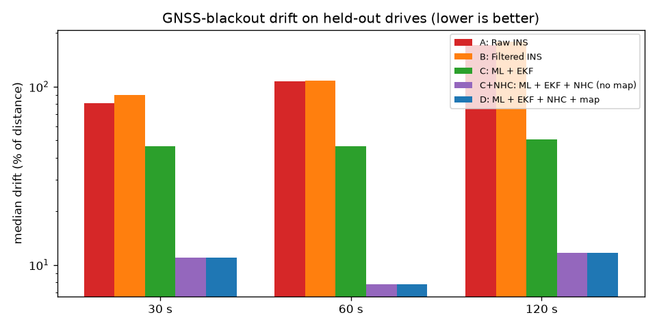

# Archived experiments

These are preserved historical experiments, kept to show how the pipeline reached the 9.9% Passenger Car MVP,
including the attempts that failed. **None of this is needed to run the MVP**, the Streamlit UI
(`src/ui/app.py`) or the ONNX export (`scripts/export_onnx.py`).

Numbers are median drift at 30 / 60 / 120 s blackouts for the full system D, using car GNSS before the blackout.
Settings were chosen on the validation drives; the test drives are shown for reference.

| Stage | Validation | Test | Outcome |
|---|---|---|---|
| pre-Step-1: static levelling, no lever arm | 23.4 / 24.7 / 20.8% | 10.9 / 7.8 / 11.6% | Superseded; see the caveat below |
| Step 1: dynamic attitude, gyro-bias observability, NHC, Q scaling | 19.6 / 16.4 / 21.9% | 15.4 / 11.0 / 13.9% | Kept |
| Step 2 as specified: MotionNet at 1 Hz with R inflation | 57.2 / 59.7 / 59.7% | 29.7 / 16.5 / 30.3% | **Failed**, rejected |
| Step 2 with 10 Hz MotionNet: lever-arm NHC and gating | 18.0 / 18.9 / 13.7% | 17.0 / **9.9** / 21.3% | **Kept: this is the MVP** |
| Step 3: MotionNet bias state b_v (τ 4.7 s) + b_a clamp | 38.4 / 50.9 / 38.8% | 18.0 / 16.1 / 24.5% | **Failed**; every τ and σ variant was worse |
| MVP accelerometer decoupling (MotionNet-only speed) | 25 / 19 / 20% | 60 s: 12.8% | **Failed**, rejected |
| Anomaly detector v1 (1 rad/s gyro, 3° tilt) | not run | 60 s: 11.4% | **Failed**; replaced by v2 |

Caveat on pre-Step-1: it scores better on the test drives but worse on validation. It relied on a fixed
levelling, which breaks when the phone moves, so it was not kept.

## Pre-Step-1 test run (formerly the main README headline)

36 simulated GNSS blackouts on drives never used for training or tuning: **S1** (an unseen drive of
training driver A) and **M** (a driver who is not in the training set). Every variant replays the
identical windows. Lower is better.

**Median drift as % of distance travelled**

| Blackout (mean distance) | A: Raw INS | B: Filtered INS | C: ML + EKF | C+NHC: no map | **D: full system** |
|---|---|---|---|---|---|
| 30 s (251 m) | 80.4% | 89.6% | 46.3% | 11.0% | **11.0%** |
| 60 s (470 m) | 107.3% | 107.7% | 46.3% | 7.8% | **7.8%** |
| 120 s (957 m) | 171.3% | 178.1% | 50.7% | 11.7% | **11.7%** |

Over all 36 windows:

| | A: Raw INS | C+NHC | **D: full system** |
|---|---|---|---|
| Mean drift | 165% | 15.4% | **12.3%** |
| 90th-percentile drift | 294% | 28.3% | **25.3%** |
| Worst window | 858% | 77.9% | **33.4%** |
| Speed RMSE in blackout | 5.9 m/s | 1.8 m/s | **1.8 m/s** |

- **D beats raw INS in all 36 of 36 windows.** The median endpoint error after 120 s / ~1 km is 99 m, against 1.45 km for raw INS.
- **The map helps on the worst windows.** It changed the result by more than 1 point in 8 windows: 6 better, 2 worse. It cut the worst case from 78% to 33%.
- **MotionNet alone** (IMU → speed, 18k parameters, 0.9 ms per call) has 3.07 m/s test RMSE and 2.09 m/s MAE. Validation RMSE is 5.71 m/s: validation includes driver E's noisier phone and faster roads.
- **Zero GNSS updates inside any blackout** (asserted on every run). `python -m src.audit leakage` passed all 10 checks.
- **Runtime** is 0.65 ms per 10 Hz step for the full Python stack, i.e. more than 1,500 Hz on one CPU core.

Per-window numbers are in `results/pre_step1_test_run/metrics/eval_windows_test.csv`. Plots are in `results/pre_step1_test_run/plots/`
(`summary_test.png`, `traj_*`: trajectory plus error-vs-time) and `results/motionnet_v1/motionnet_gru_*` (the v1 model used by this run). When C+NHC and D coincide
(no road matched), the purple line is hidden under the blue one.

How it was produced: MotionNet trained on 30 drives, then filter and map settings chosen on the validation drives
only (`python -m archive_experiments.tune`, `results/tuning_val.csv`): NHC σ 0.15 m/s, MotionNet σ ×1.0,
across-road σ 8 m. The test drives were then evaluated once with those settings.

## Contents

| Path | What it is |
|---|---|
| `ablation.py` | Runs every setting above on the same windows: `python -m archive_experiments.ablation --drives val --gnss vehicle`. |
| `results/ablations/*.csv` | Output of `ablation.py`, per window. `s2` = Step 2 study, `s3`/`s3b` = Step 3 and the σ_acc sweep; `val`/`test` × `vehicle`/`phone` GNSS. |
| `tune.py`, `results/tuning_val.csv` | The original validation-only sweep for NHC σ, MotionNet σ and road σ (pre-Step-1): `python -m archive_experiments.tune`. |
| `results/pre_step1_test_run/` | The first full test evaluation (pre-Step-1 pipeline): metrics, summary plot and trajectory plots. |
| `models/motionnet_v1_pre_step1.pt`, `results/motionnet_v1/` | MotionNet v1, trained on the pre-Step-1 features (test RMSE 3.07 m/s). It was retrained as v2 (`results/models/motionnet.pt`) after Step 1 changed the levelling. `ablation.py` uses v1 for the `pre-Step-1` setting. |
| `anomaly_detector_v1_hypersensitive.py`, `results/anomaly_v1/` | The first anomaly detector, recovered from commit `fb4e2f3`, with its config and test log. See below. |

**Why anomaly v1 failed.** It confirmed "mount slips" from 1.0 rad/s gyro bursts (training p99) and a 3° shift of
the ungated 1 s mean specific force. On normal roads, turns and braking move that direction by more than 17° 1% of
the time, so it re-levelled about 500 times per hour on training data. On the test drives it confirmed 23 slips,
and its forced re-levels pushed the 60 s median to 11.4% (one window went from 8% to 138%). v2 (`src/anomaly_detector.py`)
needs a 3 rad/s burst (training p99.99) and a 10° shift in gated, near-1 g windows.

**Failed ideas that still exist as switches.** The code for the 1 Hz MotionNet (`filter.motion_update_hz: 1.0`,
`motion_err_tau_s: 6.7`), the b_v state (`filter.motion_bias_state: true`) and decoupling
(`filter.dr_accel_mode: decouple`) lives in the core engine files. It stays there, switched off by default, so
`ablation.py` can reproduce these results. The full step-by-step history is in the git log (`git log --oneline`).
